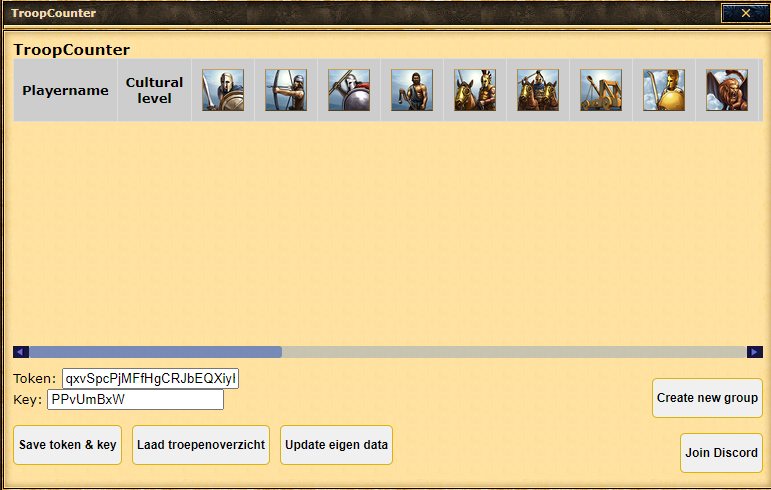
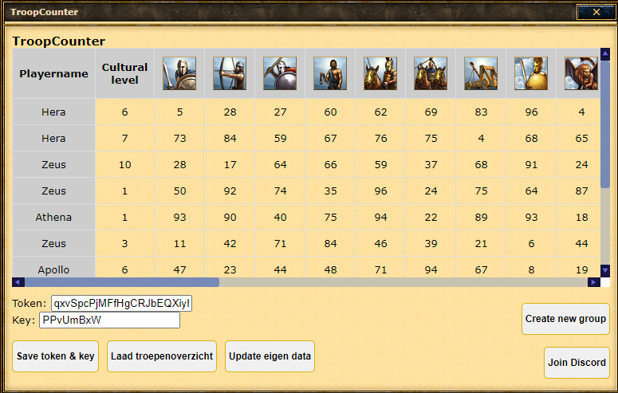

# Troopcounter Script (English guide)

## Disclaimer

This script has been approved by the Grepolis NL support team, it is not on the wiki yet but support gave me permission to share and use the troopcounter. It is only approved on the NL servers. I am not responsible for any misuse of this script, including manipulating it to perform unauthorized actions. If you get banned for using or abusing this script, I am not responsible.

## Overview
The Troopcounter script is a custom-developed tool designed for players of the game Grepolis to track and manage troop data efficiently. This tool enables synchronization of troop information with a central server, viewing troop counts of group members, and regular updates of your own data. It is particularly useful for players who are part of an organized group and wish to maintain an overview of collective troop strength.

## Features
* Group creation: You can create a group for your team or alliance, where you can generate and share a token and key for your members.
* Group Synchronization: Synchronize your troop data with a server using a group-specific token and key.
* Manual Data Submission: You can manually update your troop data at any time by clicking a button.
* Local Storage: Your token and key are stored locally when you click on the save token & key button, so you don't need to re-enter them every time you play.
* Encryption: Your user data is securely encrypted using CryptJS. The encryption key is essential for decrypting this data. Without the key, the data remains inaccessible and unusable.
##  How It Works
### Installation
1. Install a user script manager like Tampermonkey for your browser.
2. Add the Troopcounter script via the following link: [Troopcounter Script.](https://greasyfork.org/en/scripts/503469-troopcounter)
3. Open Grepolis and start using the Troopcounter by entering your group's token and key.

### 2. Troopcounter gebruiken
1. When you open Grepolis, you will see an extra button above the god-view. Use this button to open the Troopcounter overview.

2. When you open the screen, you will see the following screen because you haven't set up a token and key yet. You now have two options:

    * Use existing group: This means that a group has already been created for you and your teammates. You already have a token and key, so choose this option.
    * Create a new group: Choose this option if you don't have a token and key yet. This button will take you to the screen where you can create a group and generate a token and key.

3. When you choose "Use existing group," you'll be taken to the following screen. Simply enter the token and key of your group and click "Save token & key." Your browser will automatically refresh after 2 seconds, and all data will be correctly saved.

4. If you choose "Create a new group," you'll see the following screen. Here, you can enter your group's name and generate a token and key. When you click "Save group," your browser will refresh, and your token and key will be stored locally so you don't have to enter them again. You can now share them with your group/alliance.

5. The overview looks like this. You have several buttons:
    * Save token & key: Save the token and key.
    * Load troop overview: This will display the troops of the players in your group.
    * Update own data: This sends your troop information to the server, encrypted, of course.

### Support

You can always join our Discord server for feature suggestions or if you need assistance. [Discord.](https://discord.gg/rvETEWWQmf)

# Troepenteller Script (Nederlands handleiding)

## Disclaimer

Dit script is goedgekeurd door het Grepolis NL-supportteam, het staat nog niet op de wiki, maar support heeft me toestemming gegeven om de troopcounter te delen en te gebruiken. Het script mag alleen worden gebruikt op de NL-servers. Ik ben niet verantwoordelijk voor misbruik van dit script, inclusief het manipuleren ervan om ongeautoriseerde acties uit te voeren. Als je wordt verbannen door het gebruik of misbruik van dit script, ben ik niet verantwoordelijk.

## Overzicht
Het Troepenteller-script is een op maat gemaakte tool voor spelers van het spel Grepolis om troepen efficiënt te volgen en te beheren. Met deze tool kun je troepeninformatie synchroniseren met een centrale server, de troepenaantallen van groepsleden bekijken en regelmatig je eigen gegevens bijwerken. Dit is vooral handig voor spelers die deel uitmaken van een georganiseerde groep en een overzicht willen houden van de collectieve troepensterkte.

## Functies
* Groep aanmaken: Je kunt een groep aanmaken voor jouw team of alliantie, waar je een token en een sleutel kunt genereren en delen met je leden.
* Groep Synchronisatie: Synchroniseer je troepgegevens met een server met behulp van een groepsspecifieke token en sleutel.
* Handmatige Gegevensinzending: Je kunt je troepgegevens op elk moment handmatig bijwerken door op een knop te klikken.
* Lokale Opslag: Je token en sleutel worden lokaal opgeslagen als je op de save token & key knop klikt, zodat je ze niet elke keer hoeft in te voeren.
* Versleuteling: Uw gebruikersgegevens worden veilig versleuteld met CryptJS. De versleutelingssleutel is essentieel voor het ontsleutelen van deze gegevens. Zonder de sleutel blijven de gegevens ontoegankelijk en niet bruikbaar.
## Hoe Het Werkt
### 1. Installatie
1. Installeer een gebruikersscriptbeheerder zoals Tampermonkey voor je browser. [Tampermonkey](https://www.tampermonkey.net/)
2. Voeg het Troepenteller-script toe via de volgende link: [Troepenteller Script.](https://greasyfork.org/en/scripts/503469-troopcounter)
3. Open Grepolis en het script zal automatisch actief zijn.
### 2. Troopcounter gebruiken
1. Bij het openen van Grepolis zie je een extra knop boven de god-weergave. Via deze knop kun je het Troepenteller-overzicht openen.

2. Wanneer je het scherm opent, zie je het volgende scherm. Dit komt omdat je nog geen token en sleutel hebt ingesteld. Je hebt nu twee opties:

    * Gebruik bestaande groep: Dit betekent dat er al een groep is aangemaakt voor jou en je medespelers. Je hebt al een token en sleutel, dus kies deze optie.
    * Maak een nieuwe groep aan: Kies deze optie als je nog geen token en sleutel hebt. Via deze knop kun je naar het scherm gaan om een groep te maken en een token en sleutel te genereren.

3. Als je "Gebruik bestaande groep" kiest, kom je op het volgende scherm terecht. Vul hier de token en sleutel van je groep in en klik op "Save token & key". Je browser wordt automatisch ververst na 2 seconden en dan zijn alle gegevens correct opgeslagen.

4. Als je kiest voor "Maak een nieuwe groep aan", zie je het onderstaande scherm. Hier kun je de naam van je groep invoeren en een token en sleutel genereren. Wanneer je op "Save group" klikt, ververst je browser en worden je token en sleutel lokaal opgeslagen, zodat je deze niet meer hoeft in te vullen. Je kunt deze nu ook delen met je groep/alliantie.

5. Het overzicht ziet er als volgt uit. Je hebt verschillende knoppen:
    * Save token & key: Sla de token en sleutel op.
    * Laad troepenoverzicht: Dit toont de troepen van de spelers in je groep.
    * Update eigen data: Hiermee stuur je je troepeninformatie versleuteld naar de server.

### Support

Je kunt altijd onze Discord-server joinen voor het doen van functievoorstellen of als je hulp nodig hebt. [Discord.](https://discord.gg/rvETEWWQmf)

